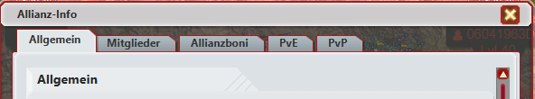
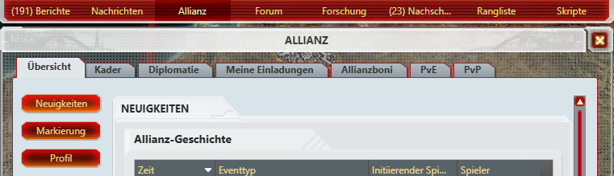
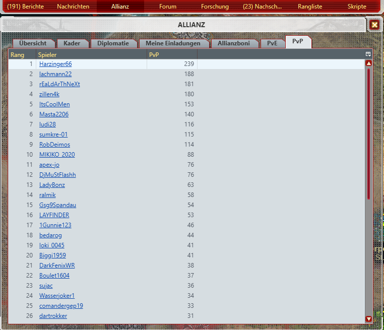

# CnC-TA Allianz PvP-PvE-HE

Erweiterung für **Command & Conquer: Tiberium Alliances**, die die PvP- und PvE-Ergebnisse der Mitglieder der **eigenen Allianz** direkt im Allianzfenster anzeigt.

---

## 📌 Funktionen

Das Script erweitert die Allianzfenster von C&C TA um zwei zusätzliche Reiter:

- **PvE**
- **PvP**

In beiden Reitern werden die Mitglieder der eigenen Allianz nach ihrem jeweiligen Ergebnis sortiert angezeigt.

### PvE

Zeigt die Allianzmitglieder nach ihren **PvE-Ergebnissen** sortiert.

### PvP

Zeigt die Allianzmitglieder nach ihren **PvP-Ergebnissen** sortiert.

Die Werte werden direkt aus den öffentlichen Spielerdaten von C&C TA ermittelt.

---

## 🏰 Unterstützte Allianzfenster

Das Script funktioniert in beiden Allianzansichten des Spiels.

### Kleines Allianz-Infofenster

Die vorhandenen Reiter bleiben erhalten und werden um **PvE** und **PvP** ergänzt.

Beispiel:

`Allgemein | Mitglieder | Allianzboni | PvE | PvP`

---

### Großes Allianzfenster

Auch das über das Hauptmenü erreichbare Allianzfenster wird erweitert.

Die vorhandenen Reiter bleiben erhalten und werden ebenfalls um **PvE** und **PvP** ergänzt.

Beispiel:

`Übersicht | Kader | Diplomatie | Meine Einladungen | Allianzboni | PvE | PvP`

---

## 📊 Anzeige der Ergebnisse

Die Mitglieder werden innerhalb der jeweiligen Liste nach ihrem Ergebnis sortiert.

Damit lässt sich schnell erkennen:

- Wer innerhalb der Allianz die meisten PvE-Punkte erzielt hat
- Wer die meisten PvP-Punkte erzielt hat
- Wie die einzelnen Allianzmitglieder im Vergleich zueinander stehen

---

## 🔒 Nur die eigene Allianz

Das Script ist bewusst auf die **eigene Allianz** ausgelegt.

Beim Öffnen fremder Allianzen werden die zusätzlichen PvE-/PvP-Reiter nicht mit den Daten der eigenen Allianz angezeigt.

Dadurch bleiben die Allianzansichten anderer Allianzen unverändert.

---

## ⚙️ Technische Informationen

Das Script verwendet die öffentlichen Spielerdaten von C&C TA.

Für jedes Allianzmitglied werden unter anderem folgende Informationen abgefragt:

- Spielername
- Spieler-ID
- PvE-Ergebnis
- PvP-Ergebnis
- Allianzzugehörigkeit

Die Daten werden anschließend im Allianzfenster in eigenen Tabellen dargestellt.

---

## 🧩 Voraussetzungen

Benötigt werden:

- **C&C Tiberium Alliances**
- **Firefox, Chrom oder ein anderer kompatibler Browser**
- **Tampermonkey**
- **infernal Wrapper

Das Script ist für die Verwendung als Tampermonkey-Userscript vorgesehen.

---

## 📥 Installation

### 1. Tampermonkey installieren

Falls noch nicht vorhanden, zunächst Tampermonkey im Browser installieren.

### 2. Script installieren

Die Userscript-Datei:

**infernal Wrapper
**CnC-TA Allianz PvP-PvE - HE.user.js**

in Tampermonkey installieren.

### 3. C&C TA neu laden

Nach der Installation das Spiel neu laden.

Anschließend werden die zusätzlichen Reiter automatisch in den Allianzfenstern angezeigt.

---

## 🔄 Update

Das Script enthält eine automatische Update-URL.

Dadurch kann Tampermonkey zukünftige Versionen automatisch erkennen.

---

## 🖼️ Screenshots

### PvE / PvP im Allianzfenster

### Großes Allianzfenster

### Mitglieder mit PvP-/PvE-Werten

---

## 📜 Version

**Version:** 0.6.0

**Autor:** Harzi

---

## ⚠️ Hinweis

Dieses Script ist eine eigenständige Weiterentwicklung für C&C Tiberium Alliances.

Es verändert keine gespeicherten Allianz- oder Spielerdaten.  
Die zusätzlichen Informationen werden lediglich aus den vorhandenen Spieldaten ausgelesen und im Allianzfenster dargestellt.

---

## 🔗 Repository

**CnC-TA-Allianz-PvP-PvE-HE**

https://github.com/Harzi66/CnC-TA-Allianz-PvP-PvE-HE
